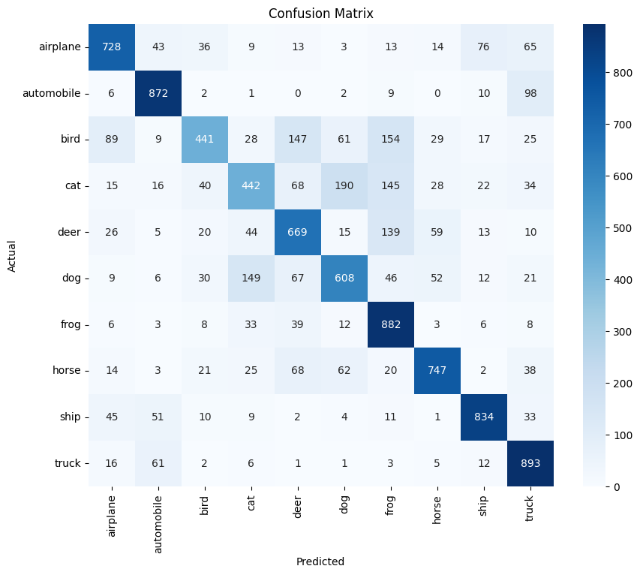
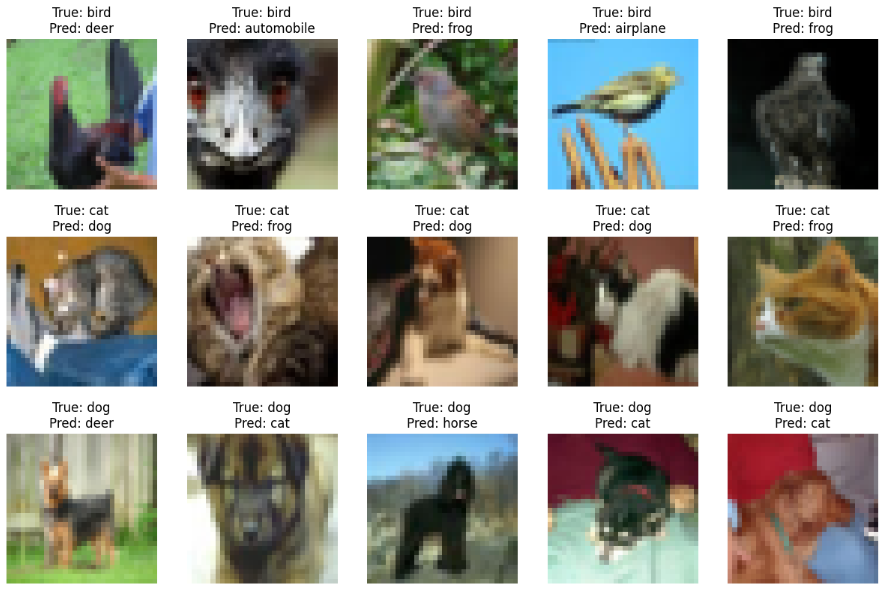
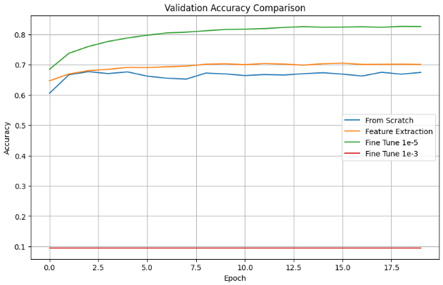

# 🖼️ End-to-End CNN Optimization & Transfer Learning (CIFAR-10)

## 📝 Project Overview
This repository contains a comprehensive empirical study and an end-to-end deep learning pipeline for multi-class image classification using the **CIFAR-10 dataset**. The project systematically explores the impact of various Convolutional Network architectures, optimization techniques, and Transfer Learning strategies to maximize performance.

## 🛠️ Tech Stack
* **Framework:** TensorFlow / Keras
* **Visualization:** Matplotlib, Seaborn
* **Analysis:** Scikit-learn (Confusion Matrix, Classification Report)

## 🔬 Experimental Pipeline
1. **Data Preprocessing:** Standardizing CIFAR-10 data.
2. **Ablation Studies:** Comparing network depth and filter configurations.
3. **Regularization:** Implementing Dropout, Data Augmentation, and Early Stopping.
4. **Optimization:** Benchmarking Adam, SGD, RMSprop, Adagrad, and Nadam with LR tuning.
5. **Transfer Learning:** Fine-tuning VGG16 for improved accuracy.
6. **Error Analysis:** Visualizing misclassifications and confusion matrices.

## 📊 Key Results & Analysis

### 🎯 Confusion Matrix & Error Detection
This section showcases the best model's performance. The Confusion Matrix helps identify which classes are most frequently confused (e.g., Cat vs. Dog), while the sample analysis provides visual insight into the model's "blind spots."

  
    
  

---

### 🚀 Transfer Learning Performance (VGG16)
By leveraging the VGG16 architecture, we compared training from scratch against feature extraction and fine-tuning. The following plot illustrates the superior convergence and accuracy achieved through transfer learning.

  

